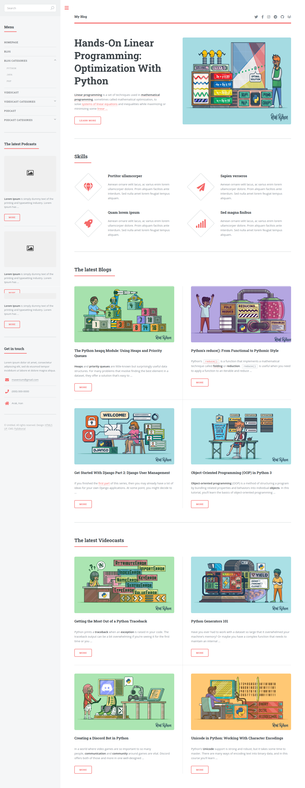
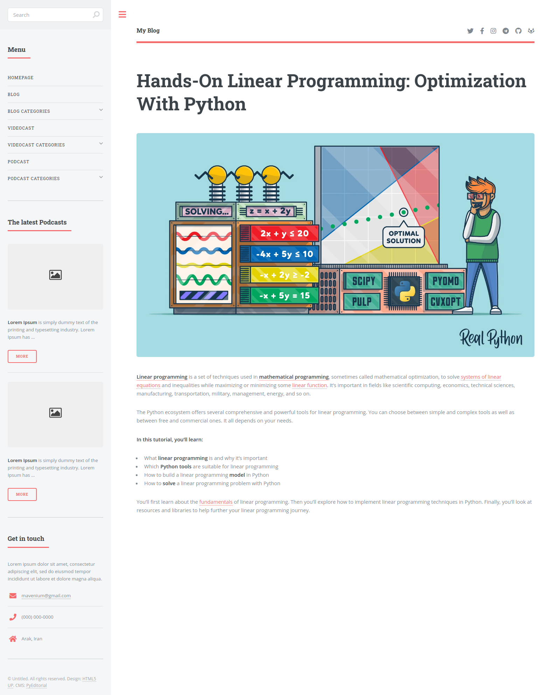
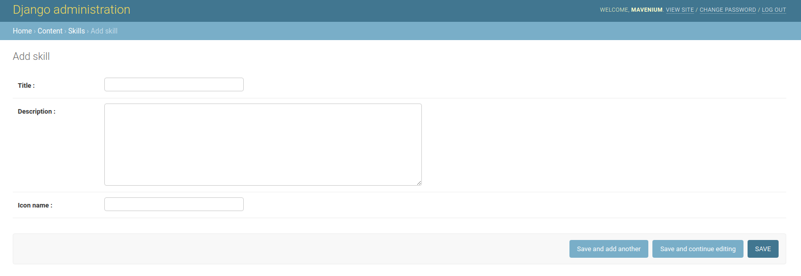
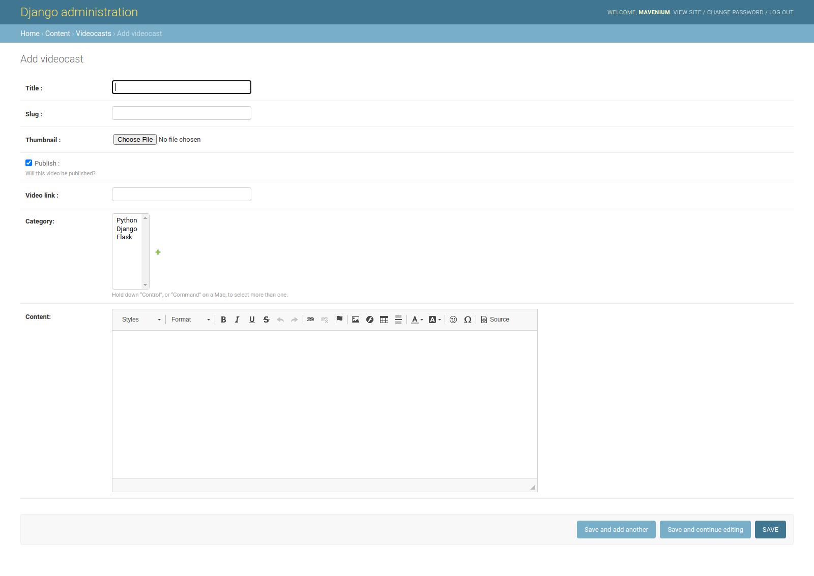

# PyEditorial

PyEditorial is a content management system designed to manage and publish blogs, podcasts, videocasts, and other multimedia content. This README provides a comprehensive guide to installing, using, and contributing to the project.

## Table of Contents

- [Features](#features)
- [Installation](#installation)
- [Usage](#usage)

## Features

- **Content Management**: Easily add and manage blogs, podcasts, videocasts, and other content.
- **User-Friendly Interface**: Simple and intuitive admin panel.
- **Multimedia Support**: Full support for various types of multimedia content.
- **Customization**: Flexible settings to customize the content presentation.

## Installation

### Prerequisites

- Python 3.6+
- Docker (optional, for containerized setup)

### Using Docker

1. Clone the repository:
    ```sh
    git clone https://gitlab.com/erenduyuk/pyeditorial.git
    cd pyeditorial
    ```

2. Build the Docker image:
    ```sh
    docker build -t pyeditorial .
    ```
3. Run the Docker containers:
    ```sh
    docker run -d -p 8000:8000 pyeditorial
    ```

### Manual Installation

1. Clone the repository:
    ```sh
    git clone https://github.com/yourusername/pyeditorial.git
    cd pyeditorial
    ```

2. Install the required Python packages:
    ```sh
    pip install -r requirements.txt
    ```

3. Apply migrations and run the server:
    ```sh
    python manage.py migrate
    python manage.py runserver
    ```

4. To access the website, navigate to http://127.0.0.1:8000 or http://localhost:8000

## Usage

To access the admin panel, navigate to `http://127.0.0.1:8000/admin` and log in with your admin credentials. From there, you can manage blogs, podcasts, videocasts, and other content.

## Screenshots

Here are some screenshots of PyEditorial in action:

### Add Blog


### Add Podcast


### Add Skill


### Add Videocast
